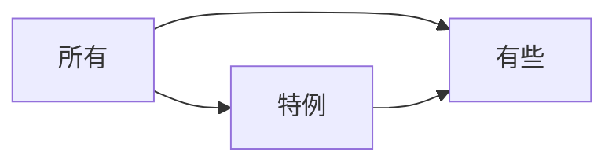

# 一个符号两种条件

A ➡ B：A是B的充分条件，B是A的必要条件

前提/基础 是 必要条件，在箭头指向的方向；充分条件在箭头的起点的方向

# 命题的形式与真假判断

命题的四种形式：原命题、逆命题、否命题、逆否命题
原命题和逆否命题的真值相同。

命题的真假：对于命题A ➡ B，只有在A且非B时，命题为假，其余情况均为真
|A ➡ B| A | B |
| :--: | :--: | :--: |
| 真 | 真 | 真 |
| 假 | 真 | 假 |
| 真 | 假 | 真 |
| 真 | 假 | 假 |

# 德摩根定律

非(A或B) = 非A且非B
非(A且B) = 非A或非B

# 范畴

非(所有A都是B) = 有些A不是B

所有、有些、特例的推出关系：

# 可能关系

非(可能) = 必然不/不可能

# 五种命题

如果A那么B：A ➡ B
只有A才B：B ➡ A
除非A否则B：A假则B真，A真则B假
或者A或者B：A和B至少有一个是真，即如果A是假，那么B一定是真（此谓否一推一）
要么A要么B：只能一真一假，其否定是都为真或都为假

# 三段论错误推理的考察

三段论的错误推理有两种：
- 逆命题、否命题错误
- 整体属性与个体属性


我国的佛教寺庙分布于全国各地，曾济寺是我国的佛教寺庙，所以曾济寺分布于我国各地。
下列选项中所犯的逻辑错误与上述推理最为相似的是：
A. 父母酗酒的孩子爱冒险，小华爱冒险，所以小华的父母酗酒
B. 文明公民都是遵纪守法的，有些大学生遵纪守法，所以有些大学生是文明公民
C. 寒门学子上大学机会减少，大学生小飞不是寒门学子，所以小飞上大学的机会不会减少
D. 现在的独生子女娇生惯养，何况他还是三代单传的独苗呢

解析：
对于题目，所犯的错误是整体属性与个体属性混淆，推理格式为：我国的佛教寺庙➡️分布于全国各地，曾济寺➡️分布于全国各地
A. 父母酗酒➡️孩子爱冒险，小华爱冒险➡️父母酗酒，推理方向相反
B. 文明公民➡️遵纪守法，大学生遵纪守法➡️大学生是文明公民，推理方向相反
C. 寒门学子➡️上大学机会少，小飞不是寒门弟子➡️机会不少，和条件相互否定
D. 独生子女➡️娇生惯养，他是独生子女➡️更被娇生惯养，最为相似
选D


